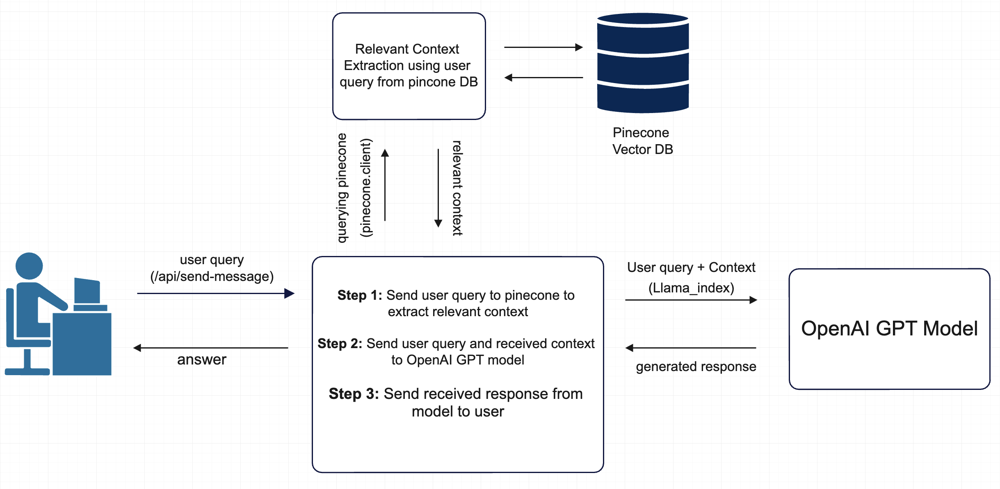

# Document Based Content Generation Bot

Our company specializes in providing a web application that allows users to generate dynamic content that can be embedded on their own websites. This content generation capability is a valuable tool for users who want to engage their website visitors with real-time content, provide personalized responses, or enhance their site's interactivity.

## Our Solution 



# Content Generator App Setup Guide

This guide will walk you through the process of setting up a content generator application with a Flask backend and a frontend interface. Follow the steps below to get started.

## Prerequisites

Before you begin, ensure that you have the following software installed on your system:

- Python (3.x recommended)
- Flask (Python web framework)
- Node.js and npm (for frontend setup)
- Mysql server (for database)

## Setup

1. **Download the code:**
Extract the folder, and open the main root folder.

2. **Excute command for setup environment:**

   ```shell
   ./setup.sh
   ```

3. **Setting environment variables:**
To configure additional environment variables for your application, In backend/.env file and define them as follows:

   * OPENAI_API_KEY=ENTER_YOUR_OPENAI_KEY
   * DOC_PATH=ENTER_YOUR_DOCUMENT_PATH
   * VECTOR_DB_PATH=ENTER_YOUR_VECTOR_DATABASE_PATH

   <br>

4. **Configure the frontend to communicate with the backend:**

   Update the API endpoint in your frontend code in .env to match the backend URL (e.g., http://127.0.0.1:4000).

5. **Start development server:**

   ```shell
   ./launch-webapp.sh
   ```

The frontend will be available at [http://localhost:3000](http://localhost:3000) (by default).
<br>

## **For Production:**

1. **Download the code:**
Extract the folder, and open the main root folder.

2. **Excute command for setup environment:**

   ```shell
   ./setup.sh
   ```

3. **Setting environment variables:**
To configure additional environment variables for your application, in backend/.env file and define them as follows:

   * OPENAI_API_KEY=ENTER_YOUR_OPENAI_KEY
   * DOC_PATH=ENTER_YOUR_DOCUMENT_PATH
   * VECTOR_DB_PATH=ENTER_YOUR_VECTOR_DATABASE_PATH

   <br>

4. **Start backend server:**
   
   ```shell
   cd backend
   gunicorn runServer:app
   ```

5. **Configure the frontend to communicate with the backend:**

   Update the API endpoint in your frontend code in .env to match the backend URL (e.g., http://127.0.0.1:8000).

6. **Start frontend server:**
   
   ```shell
   cd frontend
   npm run build
   npm run start
   ```

Be sure to configure environment variables, security settings, and database connections as needed.
The frontend will be available at [http://localhost:3000](http://localhost:3000) (by default).

<br>

# Deploying Flask and Next.js Apps on an EC2 Instance 
This guide provides step-by-step instructions on how to deploy a Flask app and a Next.js app on an EC2 instance using Nginx as a reverse proxy. The Flask app will be accessible via the /api route, while the Next.js app will be served on the base URL.

## Prerequisites
Before you begin, make sure you have the following:

- An AWS EC2 instance with SSH access.
- A domain or subdomain pointing to the IP address of your EC2 instance (you can use Route 53 or any DNS provider).
Python and Node.js installed on your EC2 instance.

<br>

## Clone Code

Clone code from git repository.

```shell
git clone your_app.git
```

<br>

## Deploying the Flask App
1. **Change to Flask App Directory**

    Move to backend directory for setup flask app.

    ```shell
    cd backend
    ```

2. **Set Up a Virtual Environment**
    Create and activate a virtual environment for your Flask app.

    ```shell
    python3 -m venv venv
    source venv/bin/activate
    ```
3. **Install Dependencies**

    Install the required Python packages for your Flask app.

    ```shell
    pip install -r requirements.txt
    ```

4. **Configure Flask App**

    To configure additional environment variables for your application, in backend/.env file and define them as follows:

   * OPENAI_API_KEY=ENTER_YOUR_OPENAI_KEY
   * DOC_PATH=ENTER_YOUR_DOCUMENT_PATH
   * VECTOR_DB_PATH=ENTER_YOUR_VECTOR_DATABASE_PATH

<br>

5. **Run Flask App**

    Run your Flask app on a specific port, e.g., 5000.

    ```shell
    python app.py
    ```

<br>

## Deploying the Next.js App
1. **Change to Next App Directory**

    Move to frontend directory for setup next app.

    ```shell
    cd frontend
    ```

2. **Configure the frontend to communicate with the backend:**

   Update the API endpoint in your frontend code in .env to match the backend URL (e.g., http://YOUR_EC2_URL/api).

3. **Install Dependencies and Build the App**

    Install the required Node.js packages and build the Next.js app for production.

    ```shell
    npm install
    npm run build
    ```

4. **Run Next App**
    
    Run your Next app on a port 3000.

    ```shell
    npm run start
    ```

<br>

# Nginx Config

Certainly! Here are example Nginx configuration files for both the Flask app (served on the /api route) and the Next.js app (served on the base URL) on an EC2 instance:

## Nginx Configuration for Flask App

Create an Nginx server block configuration file for the Flask app, e.g., <b>/etc/nginx/sites-available/flask_app</b>.

```
server {
    listen 80;
    server_name your_domain_or_ip;

    location /api {
        proxy_pass http://127.0.0.1:5000; # Flask app running on port 5000
        proxy_set_header Host $host;
        proxy_set_header X-Real-IP $remote_addr;
    }

    # Add other location blocks or configurations as needed
}
```

Now, create a symbolic link to this configuration file in the <b>/etc/nginx/sites-enabled</b> directory:

```shell
sudo ln -s /etc/nginx/sites-available/flask_app /etc/nginx/sites-enabled/
```

<br>

## Nginx Configuration for Next.js App
Create an Nginx server block configuration file for the Next.js app, e.g., <b>/etc/nginx/sites-available/nextjs_app</b>.

```
server {
    listen 80;
    server_name your_domain_or_ip;

    location / {
        proxy_pass http://127.0.0.1:3000; # Next.js app running on port 3000
        proxy_set_header Host $host;
        proxy_set_header X-Real-IP $remote_addr;
    }

    # Add other location blocks or configurations as needed
}
```

Create a symbolic link to this configuration file in the <b>/etc/nginx/sites-enabled</b> directory:

```shell
sudo ln -s /etc/nginx/sites-available/nextjs_app /etc/nginx/sites-enabled/
```

## Restart Nginx
After creating both configuration files, restart Nginx to apply the changes:

```shell
sudo systemctl restart nginx
```

Make sure to replace your_domain_or_ip with your actual domain or IP address.

These configurations will proxy requests to the Flask app to /api and requests to the Next.js app to the base URL, allowing both apps to coexist on the same EC2 instance with Nginx.

<br>

## Additional Considerations
Set up SSL/TLS certificates using Let's Encrypt to enable HTTPS for both apps.
Configure your domain's DNS settings to point to your EC2 instance's IP address.
Use environment variables to store sensitive information and secret keys securely.
Set up a process manager like systemd or pm2 to ensure your Flask and Next.js apps automatically start on system boot.
By following these steps, you can successfully deploy both your Flask and Next.js apps on an EC2 instance with Nginx, making them accessible via your domain or IP address.

## Contact Support
If you encounter any issues or have questions at any stage of the process, please don't hesitate to reach out to our support team at support@example.com. We're here to assist you.
